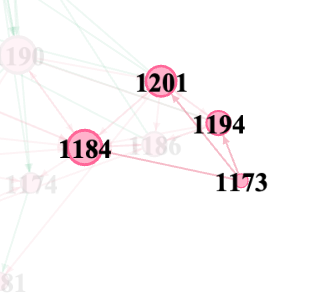

# social network in primary school students

## Background

we handed out questionnaires to 227 students from 8 classes of 3 rural primary schools. In this questionnaire, the students were asked to list 5 classmates  they like most and 5 classmates they dislike most. We use the information to constructed their social network as a graph and visualized it to get insights.

The raw data is not provided here for privacy reasons.

## Methods

The network of "like" and "dislike" relationships were construted as a directed graph using . The visualization was completed by .

## Results
### 1. General Graph

The social network graph of all the students, in which each color indicate a class.

### 2. Social Network Within One Class

The "like" relationship was indicated by red arrows and "dislike" by green arrows. Girls are represented by red nodes while boys by blue.

By running the commutiy detection algorithm, we found that the social network within a class was splited by gender. This is reasonable considering the age of the students and the culture of Chinese rural areas.

### 3. Different types of individuals

#### Type one: Focus

#### Type two: Love & Peace

#### Type three: Isolated

## Future works:

- Quantative analysis of the relationship of the background of the students and the social status of the students in school.
- Develop alarming systems to identify students who might need special attention using social network analysis.
